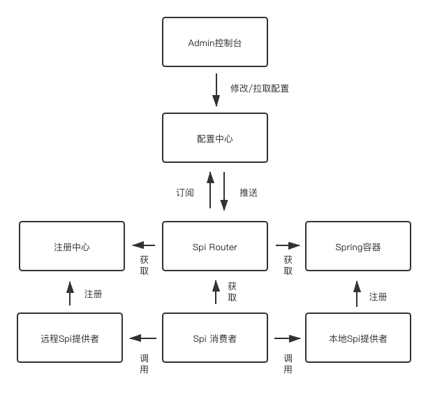
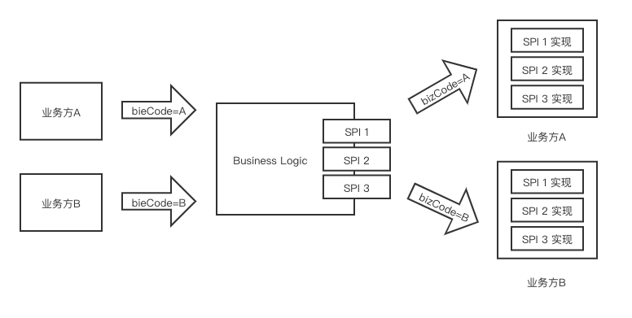

## 这是什么
相对于普通spi，你只能调用同jvm中的spi实现，本框架支持对远程spi的调用。

## 架构图


## 调用逻辑图


## 如何使用
### maven依赖
```
<dependency>
    <groupId>com.cmt</groupId>
    <artifactId>extension-core</artifactId>
    <version>1.2.0-SNAPSHOT</version>
</dependency>
```
### spi消费者
1. 增加spring配置
```
@Bean
public SpiConsumerBootStrap spiBootStrap() {
    return SpiConsumerBootStrap.create()
                    .appName("test")
                    //支持远程和本地配置 默认为LOCAL
                    .configMode(ConfigMode.REMOTE);
}
```
> configMode默认为LOCAL,需要在classpath配置spi.yml,文件示例
```yaml
appName: test
spis:
  - spiInterface: com.cmt.extension.spi.IHelloService
    extensions:
      - bizCode: a
        invokeMethod: local
        expireTime: 5000
        isDefault: true
      - bizCode: b
        invokeMethod: local
        expireTime: 5000
        isDefault: false
```  
> 若ConfigMode为REMOTE,appName需要和控制台一致  

2. 标记SPI接口
  给需要作为扩展点的接口加上SPI注解 
  ```java
@SPI
public interface IHelloService {
    String hello();
}
```
3. 注入spi
```
@Resource(name = "IHelloService")
IHelloService helloService;
```
使用spring的@Resource注解，name和接口名一致

4.注册本地默认实现
```
//@Extension(bizCode = DEFAULT_BIZ_CODE,invokeMethod = SpiTypeEnum.LOCAL)
@Extension
public class DefaultHelloServiceImpl implements IHelloService {
    public String hello() {
        return "default hello";
    }
}
```
当找不到bizCode对应的spi时，调用spi默认实现。


5. 注册spi本地实现(可选)  
```
@Extension(bizCode = "d",invokeMethod = SpiTypeEnum.LOCAL)
public class LocalHelloServiceImpl implements IHelloService {
    public String hello() {
        return "local";
    }
}
```


6. 调用
在该spi在被调用前，需要通过BusinessContext设置bizCode才能路由到正确的spi实现
```
BusinessContext.setBizCode("a");
testService.hello();
```

### spi提供者
1. 增加spring配置
```
@Bean
public  SpiProviderBootStrap businessBootStrap() {
    return SpiProviderBootStrap.create();
}
```
2. 提供spi接口远程实现
```
@Extension(bizCode = "a", invokeMethod = SpiTypeEnum.DUBBO)
public class AHelloServiceImpl implements IHelloService{
    public String hello() {
        return "HelloA";
    }
}
```

### 配置admin控制台
为了让spi消费者能够正常消费远程/本地spi，需要在admin控制台注册你的spi实现

### dubbo filter
为了在dubbo调用时传递bizCode,框架实现了com.alibaba.dubbo.rpc.Filter接口,
其中ConsumerBizCodeFilter接口从BusinessContext中获取当前bizCode并设置到RpcContext当中,
ProviderBizCodeFilter从RpcContext中获取bizCode并设置回BusinessContext.

## 示例
见源码extension-demo项目
使用步骤：
1. 本地创建数据库，脚本见release-note项目
2. 打包Extension项目，命令如下
```  mvn clean package -DskipTests=true ```
3. 启动extension-admin项目
    2.1 访问本地的http://localhost:8080
    2.2 登录系统(默认用户名:admin 密码:admin)
    2.3 打开应用管理界面去创建应用，应用名称设置为test
    2.4 打开spi管理界面，为test应用创建spi,spi的接口名称为spi-interface项目下的IHelloService接口全路径(com.cmt.extension.spi.IHelloService)
    SPI的bizCode属性见IHelloService接口所有实现类，按照与实现类上的@Extension注解的bizCode属性一致即可
4. 启动zookeeper。若本地未按照zookeeper可以启动zookeeper-server项目的内嵌zookeeper
5. 启动provider项目
6. 运行consumer项目下的ApplicationContextHolderTest类。
7. 可以自定义接口，只要按照IHelloService一样的到spi管理页面添加一下即可。
